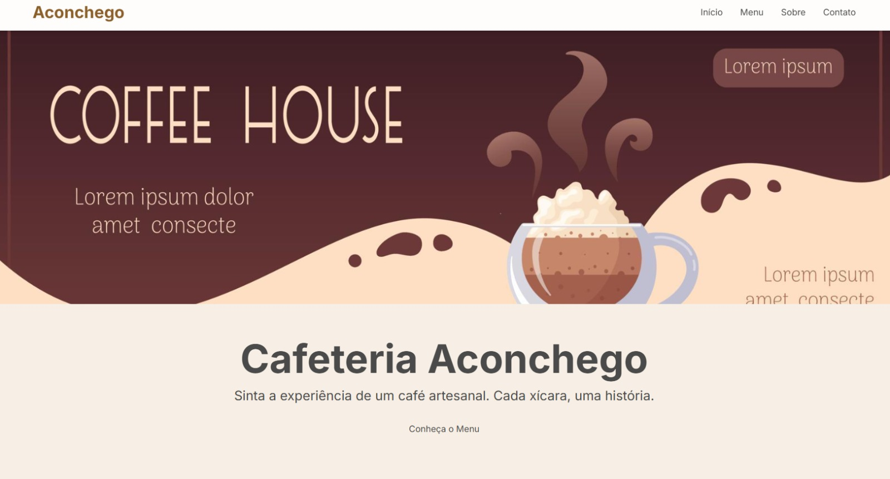
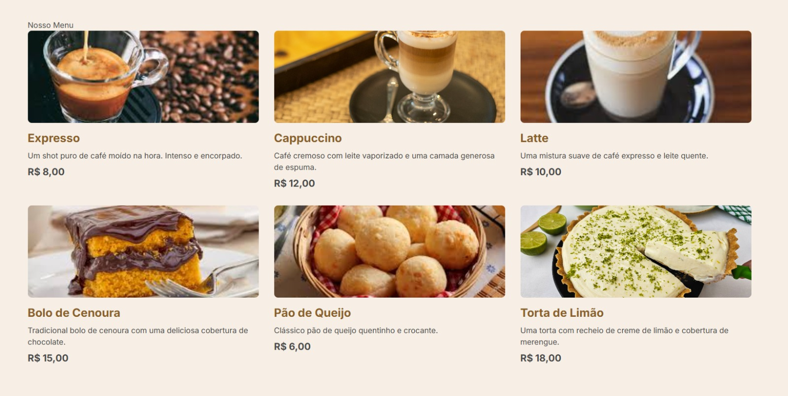

README — Cafeteria Aconchego (Versão Dev)
# ☕ Cafeteria Aconchego — Landing Page

Landing page responsiva desenvolvida para simular o website institucional de uma cafeteria artesanal.

O projeto foi criado com foco em prática de desenvolvimento Frontend moderno, organização de layout, responsividade e interatividade básica utilizando JavaScript puro.

---

## 📸 Preview

### 🔝 Visão Geral (Hero Section)



### 📄 Conteúdo da Página


---

## 🚀 Tecnologias Utilizadas

- HTML5 (Semantic Markup)
- Tailwind CSS (via CDN)
- JavaScript Vanilla (DOM Manipulation)
- Google Fonts (Inter)

---

## 🧩 Funcionalidades

- ✅ Layout totalmente responsivo
- ✅ Navbar fixa com efeito blur
- ✅ Menu mobile interativo
- ✅ Cards dinâmicos de produtos
- ✅ Seção institucional
- ✅ Formulário de newsletter com feedback visual
- ✅ Manipulação do DOM com JavaScript
- ✅ Design moderno baseado em utility-first CSS

---

## 🧱 Estrutura do Projeto


Cafeteria-Aconchego/
│
├── index.html
├── banner.jpg
├── cafe_expresso.jpeg
├── cappccino.jpg
├── latte.jpg
├── bolo.jpg
├── pao.jpg
├── torta-de-limao.jpg
├── fachada.jpg
└── preview.png


---

## ⚙️ Como Executar o Projeto

Clone o repositório:

```bash
git clone https://github.com/seu-usuario/cafeteria-aconchego.git

Acesse a pasta:

cd cafeteria-aconchego

Abra o arquivo:

index.html

Não é necessário instalar dependências ou executar build.

🧠 Conceitos Praticados

Estruturação semântica com HTML5

Utility-first CSS com Tailwind

Responsividade (Flexbox + Grid)

Manipulação do DOM

Eventos JavaScript

UX básico para landing pages

Organização visual de componentes

🔧 Melhorias Futuras

Integração real com API de newsletter

Dark mode

Animações com Framer Motion ou GSAP

Componentização em React

Deploy em Vercel ou Netlify

Otimização de imagens (performance)

🌐 Possível Deploy

O projeto pode ser publicado facilmente em:

GitHub Pages

Vercel

Netlify

👨‍💻 Autor

Walisson Patrick Helmer

💼 LinkedIn: https://www.linkedin.com/in/walissonpatrickhelmer/

💻 GitHub: https://github.com/WalissonPatrickHelmer

⭐ Projeto desenvolvido para fins educacionais e construção de portfólio Frontend.


---

# 🔥 Dica (nível portfólio forte)

Esse projeto tem **3 coisas que recrutador Frontend gosta**:

✅ Tailwind CSS  
✅ Responsividade real  
✅ JavaScript manipulando DOM  

👉 Então no LinkedIn você pode descrever como:

> *"Landing page responsiva com Tailwind CSS e interatividade em JavaScript Vanilla."*

Isso soa **muito mais profissional**.

---

Se quiser, no próximo passo posso te entregar o **README versão destaque GitHub** (🔥 nível open-source), com:

✅ badges automáticos  
✅ shields de tecnologia  
✅ layout visual profissional  
✅ seção de demo online  
✅ contador de linguagens  

— que aumenta MUITO o impacto do portfólio.